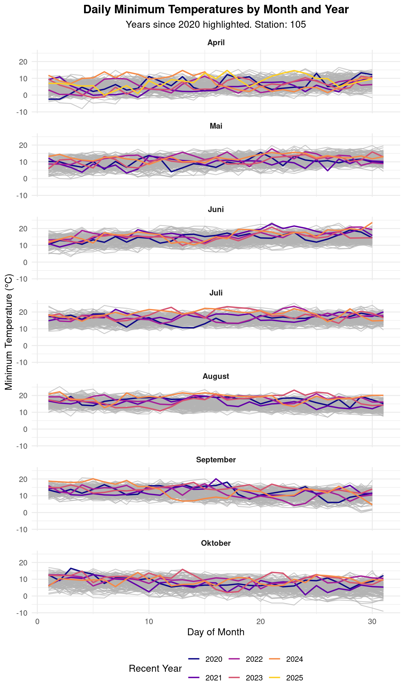

---
# -------------------------------------
# REQUIRED & COMMON FIELDS
# -------------------------------------
title: "Temperaturen in der Nacht"
author: "Robin Kohrs / Netzwerk Klimajournalismus"
date: "2025-04-27" # Use specific date, or "today" to auto-update on render
date-format: "DD MMMM YYYY" # Optional: How the date is displayed (e.g., 17 October 2023)

# -------------------------------------
# OPTIONAL DESCRIPTIVE FIELDS
# -------------------------------------
# subtitle: "SUBTITLE:..." # Optional additional detail
# abstract: | # Optional multi-line summary of the analysis goals/findings
  # Abstract
keywords: [climate data, analysis, netzwerk klimajournalismus, topic1, topic2] # Optional keywords

# -------------------------------------
# CUSTOM FIELDS (Examples - Adapt as needed)
# -------------------------------------
# You can define any key-value pairs here. They can sometimes be accessed
# within your document or code (e.g., via quarto::quarto_metadata()).
analysis:
  id: "NKA-YYYY-NN" # Example: Internal analysis ID
  version: "1.0" # Version of this specific analysis document
  status: "Draft" # E.g., Draft, In Review, Final
  lead: "Person Responsible"
data:
  source: "[Name of Data Provider/URL]"
  accessed: "YYYY-MM-DD" # Date data was downloaded/accessed
  processing_script: "[Path to script, if any]" # Reference R script used

# -------------------------------------
# EXECUTION OPTIONS (Control R/Python code execution)
# -------------------------------------
execute:
  echo: false # Set to 'true' to show code chunks by default
  warning: false # Set to 'true' to show warnings
  message: false # Set to 'true' to show messages
  # cache: true # Uncomment to cache results of computations (speeds up re-rendering)
  # error: true # Set to 'false' to stop rendering on code errors

---


## Minimaltemperaturen

### Welche Datensätze bei der Geosphere eignen sich?

- Ein-Tagesdaten mit der Minimaltemperatur zwischen 18 und 18 Uhr

- Annahme: Die Minimaltemperaturen steigen

:::{.callout-note}
## `klima-v2-1d` ist am geignetsten
:::

### Was wollen wir zeigen?

1. **Die Intensität der Tropnnächte: ** Nicht nur die Anzahl an Tropennächten sondern die minimale Temperatur


### Welche Stationen nehmen den Temperaturparamter auf?

- Nur Wien?

- Alle Landeshauptstädte?

-> Die kombinierte Station an der Wiener Hohen Warte misst seit 1872


:::{.callout-note collapse=true}

::: {.cell}

```{.r .cell-code}
meta = geosphere_explore_resource("klima-v2-1h")
```

::: {.cell-output .cell-output-stdout}
```
# A tibble: 38 × 3
  name      long_name                                      unit 
  <chr>     <chr>                                          <chr>
1 cglo      Globalstrahlung Mittelwert                     W/m² 
2 cglo_flag Qualitätsflag für Globalstrahlung Mittelwert   code 
3 dd        Windrichtung 360° Mittelwert                   °    
4 dd_flag   Qualitätsflag für Windrichtung 360° Mittelwert code 
5 ddx       Windrichtung zur Spitzenböe                    °    
6 ddx_flag  Qualitätsflag für Windrichtung zur Spitzenböe  code 
# ℹ 32 more rows
# A tibble: 38 × 3
  name      long_name                                      unit 
  <chr>     <chr>                                          <chr>
1 cglo      Globalstrahlung Mittelwert                     W/m² 
2 cglo_flag Qualitätsflag für Globalstrahlung Mittelwert   code 
3 dd        Windrichtung 360° Mittelwert                   °    
4 dd_flag   Qualitätsflag für Windrichtung 360° Mittelwert code 
5 ddx       Windrichtung zur Spitzenböe                    °    
6 ddx_flag  Qualitätsflag für Windrichtung zur Spitzenböe  code 
# ℹ 32 more rows
```
:::

```{.r .cell-code}
# tl -> paramter für Lufttemperatur in 2m
```
:::

::: {.cell}

```{.r .cell-code}
resource_id = "klima-v2-1d"
parameters = c("tlmin")
year_start=1900
year_end=2025
month_start =4
month_end = 10
station_ids = c(105)
```
:::


:::


### Get the data


::: {.cell}

```{.r .cell-code}
# download the data
walk(year_start:year_end, function(year) {
  cli::cli_inform(glue("In year: {year}"))
  # get data for one month for one year
    start_param = glue("{year}-{month_start}-01")
    days_in_end_month  = lubridate::days_in_month(as.Date(glue("{year}-{month_end}-01")))
    end_param = glue("{year}-{month_end}-{days_in_end_month}")
    
    # output path
    fn = glue("{year}_M{month_start}_to_M{month_end}.csv")
    op = sys_make_path(file.path(data_raw_path, fn))
    
    if(file.exists(op)) return()
    
    tryCatch({
      path = geosphere_get_data(
        resource_id = resource_id,
        parameters = parameters,
        start = start_param,
        end = end_param,
        station_ids = station_ids,
        output_format = "csv",
        version = 1,
        mode = "historical",
        type = "station",
        output_file = op,
        verbose = T,
        debug = F
      )
   }, error = function(e){
       cli::cli_warn("Failed processing {year}-{month}: {conditionMessage(e)}")
       return(NULL) # Return NULL on error
   })
})

# list all the files
files_each_year = dir(data_raw_path, ".*\\.csv", full.names = T)
data_each_year = files_each_year %>% map(~data.table::fread(.x)) %>% bind_rows()
```
:::


### for each month get all the yearly data


::: {.cell}

```{.r .cell-code}
# Prepare data for plotting
df_prepared <- data_each_year %>%
  # Ensure time is in Date format if not already
    mutate(time = as_datetime(time, format = "%Y-%m-%dT%H:%M%z")) %>% 
  # Extract date components
  mutate(
    year = year(time),
    month_num = month(time),
    # Create month factor with labels for nice facet titles
    month_lbl = month(time, label = TRUE, abbr = FALSE),
    day = day(time)
  ) %>%
  # Filter out rows where tlmin is NA, as they can't be plotted
  filter(!is.na(tlmin)) %>%
  # Optional: Filter for a specific station if your df has multiple
  # filter(station == 105) %>%
  # Arrange for potentially smoother plotting (optional)
  arrange(year, month_num, day)


# Define the cutoff year
highlight_year <- 2020

# Create the plot
p <- ggplot(df_prepared, aes(x = day, y = tlmin)) +

  # Layer 1: Historical years (before highlight_year) in grey
  geom_line(
    data = . %>% filter(year < highlight_year), # Filter data for this layer
    aes(group = year),                          # Group by year to get separate lines
    color = "grey70",                           # Set color to light grey
    alpha = 0.7                                 # Make slightly transparent
  ) +

  # Layer 2: Recent years (highlight_year onwards) colored by year
  geom_line(
    data = . %>% filter(year >= highlight_year), # Filter data for this layer
    aes(color = factor(year), group = year),    # Color by year (as factor)
    linewidth = 0.8                             # Make recent lines slightly thicker (optional)
  ) +

  # Facet by month - creates the grid of plots
  facet_wrap(~ month_lbl, ncol = 1) + # Adjust ncol as needed

  # Apply a nice color scale for the recent years
  scale_color_viridis_d(
      option = "plasma",      # Viridis palette options: "magma", "plasma", "inferno", "viridis", "cividis"
      end = 0.9               # Avoid the brightest color (often yellow)
  ) +

  # Add labels and title
  labs(
    title = "Daily Minimum Temperatures by Month and Year",
    subtitle = paste("Years since", highlight_year, "highlighted. Station:", first(df_prepared$station)), # Adjust if needed
    x = "Day of Month",
    y = "Minimum Temperature (°C)",
    color = "Recent Year" # Legend title for the color scale
  ) +

  # Apply a clean theme
  theme_minimal(base_size = 12) +
  theme(
    plot.title = element_text(hjust = 0.5, face = "bold"),
    plot.subtitle = element_text(hjust = 0.5),
    legend.position = "bottom", # Or "right", "left", "top"
    strip.text = element_text(face = "bold") # Make facet titles bold
   )

# Print the plot
print(p)
```

::: {.cell-output-display}
{width=672}
:::

```{.r .cell-code}
# Optional: Save the plot
# ggsave("temperature_plot.png", plot = p, width = 14, height = 10, dpi = 300)
```
:::


## Durschnittstemperatur in der Nacht im Juli


::: {.cell}

```{.r .cell-code}
resource_id = "klima-v2-1h"
start_year = 1900
end_year = 2025
month = 7

ex = geosphere_explore_resource("klima-v2-1h")
```

::: {.cell-output .cell-output-stdout}
```
# A tibble: 38 × 3
  name      long_name                                      unit 
  <chr>     <chr>                                          <chr>
1 cglo      Globalstrahlung Mittelwert                     W/m² 
2 cglo_flag Qualitätsflag für Globalstrahlung Mittelwert   code 
3 dd        Windrichtung 360° Mittelwert                   °    
4 dd_flag   Qualitätsflag für Windrichtung 360° Mittelwert code 
5 ddx       Windrichtung zur Spitzenböe                    °    
6 ddx_flag  Qualitätsflag für Windrichtung zur Spitzenböe  code 
# ℹ 32 more rows
# A tibble: 38 × 3
  name      long_name                                      unit 
  <chr>     <chr>                                          <chr>
1 cglo      Globalstrahlung Mittelwert                     W/m² 
2 cglo_flag Qualitätsflag für Globalstrahlung Mittelwert   code 
3 dd        Windrichtung 360° Mittelwert                   °    
4 dd_flag   Qualitätsflag für Windrichtung 360° Mittelwert code 
5 ddx       Windrichtung zur Spitzenböe                    °    
6 ddx_flag  Qualitätsflag für Windrichtung zur Spitzenböe  code 
# ℹ 32 more rows
```
:::

```{.r .cell-code}
data_list = map(start_year:end_year, function(year){
  start = glue("{year}-{month}-01")
  last_day_in_month = lubridate::days_in_month(glue("{year}-{month}-01"))
  end = glue("{year}-{month}-{last_day_in_month}")

    fn = glue("{year}_{month}.csv")
    op = sys_make_path(file.path(data_raw_path_hourly_data, fn))
    print(op)
    if(file.exists(op)) return(NULL)
    result = tryCatch({
      data = geosphere_get_data(
        resource_id = resource_id,
        parameters = c("tl"),
        start = start,
        end = end,
        station_ids = 105,
        type = "station",
        mode = "historical",
        output_file = op
      ) %>% data.table::fread()
    }, error = function(e) {
      cli::cli_warn("Failed processing {year}-{month}: {conditionMessage(e)}")
      return(NULL) # Return NULL on error
    })

    return(result)
})
```

::: {.cell-output .cell-output-stdout}
```
[1] "/home/robin/projects/personal/dav/wiki/data_raw/kjn/2025-05-tropennächte/hourly_data/1900_7.csv"
[1] "/home/robin/projects/personal/dav/wiki/data_raw/kjn/2025-05-tropennächte/hourly_data/1901_7.csv"
[1] "/home/robin/projects/personal/dav/wiki/data_raw/kjn/2025-05-tropennächte/hourly_data/1902_7.csv"
[1] "/home/robin/projects/personal/dav/wiki/data_raw/kjn/2025-05-tropennächte/hourly_data/1903_7.csv"
[1] "/home/robin/projects/personal/dav/wiki/data_raw/kjn/2025-05-tropennächte/hourly_data/1904_7.csv"
[1] "/home/robin/projects/personal/dav/wiki/data_raw/kjn/2025-05-tropennächte/hourly_data/1905_7.csv"
[1] "/home/robin/projects/personal/dav/wiki/data_raw/kjn/2025-05-tropennächte/hourly_data/1906_7.csv"
[1] "/home/robin/projects/personal/dav/wiki/data_raw/kjn/2025-05-tropennächte/hourly_data/1907_7.csv"
[1] "/home/robin/projects/personal/dav/wiki/data_raw/kjn/2025-05-tropennächte/hourly_data/1908_7.csv"
[1] "/home/robin/projects/personal/dav/wiki/data_raw/kjn/2025-05-tropennächte/hourly_data/1909_7.csv"
[1] "/home/robin/projects/personal/dav/wiki/data_raw/kjn/2025-05-tropennächte/hourly_data/1910_7.csv"
[1] "/home/robin/projects/personal/dav/wiki/data_raw/kjn/2025-05-tropennächte/hourly_data/1911_7.csv"
[1] "/home/robin/projects/personal/dav/wiki/data_raw/kjn/2025-05-tropennächte/hourly_data/1912_7.csv"
[1] "/home/robin/projects/personal/dav/wiki/data_raw/kjn/2025-05-tropennächte/hourly_data/1913_7.csv"
[1] "/home/robin/projects/personal/dav/wiki/data_raw/kjn/2025-05-tropennächte/hourly_data/1914_7.csv"
[1] "/home/robin/projects/personal/dav/wiki/data_raw/kjn/2025-05-tropennächte/hourly_data/1915_7.csv"
[1] "/home/robin/projects/personal/dav/wiki/data_raw/kjn/2025-05-tropennächte/hourly_data/1916_7.csv"
[1] "/home/robin/projects/personal/dav/wiki/data_raw/kjn/2025-05-tropennächte/hourly_data/1917_7.csv"
[1] "/home/robin/projects/personal/dav/wiki/data_raw/kjn/2025-05-tropennächte/hourly_data/1918_7.csv"
[1] "/home/robin/projects/personal/dav/wiki/data_raw/kjn/2025-05-tropennächte/hourly_data/1919_7.csv"
[1] "/home/robin/projects/personal/dav/wiki/data_raw/kjn/2025-05-tropennächte/hourly_data/1920_7.csv"
[1] "/home/robin/projects/personal/dav/wiki/data_raw/kjn/2025-05-tropennächte/hourly_data/1921_7.csv"
[1] "/home/robin/projects/personal/dav/wiki/data_raw/kjn/2025-05-tropennächte/hourly_data/1922_7.csv"
[1] "/home/robin/projects/personal/dav/wiki/data_raw/kjn/2025-05-tropennächte/hourly_data/1923_7.csv"
[1] "/home/robin/projects/personal/dav/wiki/data_raw/kjn/2025-05-tropennächte/hourly_data/1924_7.csv"
[1] "/home/robin/projects/personal/dav/wiki/data_raw/kjn/2025-05-tropennächte/hourly_data/1925_7.csv"
[1] "/home/robin/projects/personal/dav/wiki/data_raw/kjn/2025-05-tropennächte/hourly_data/1926_7.csv"
[1] "/home/robin/projects/personal/dav/wiki/data_raw/kjn/2025-05-tropennächte/hourly_data/1927_7.csv"
[1] "/home/robin/projects/personal/dav/wiki/data_raw/kjn/2025-05-tropennächte/hourly_data/1928_7.csv"
[1] "/home/robin/projects/personal/dav/wiki/data_raw/kjn/2025-05-tropennächte/hourly_data/1929_7.csv"
[1] "/home/robin/projects/personal/dav/wiki/data_raw/kjn/2025-05-tropennächte/hourly_data/1930_7.csv"
[1] "/home/robin/projects/personal/dav/wiki/data_raw/kjn/2025-05-tropennächte/hourly_data/1931_7.csv"
[1] "/home/robin/projects/personal/dav/wiki/data_raw/kjn/2025-05-tropennächte/hourly_data/1932_7.csv"
[1] "/home/robin/projects/personal/dav/wiki/data_raw/kjn/2025-05-tropennächte/hourly_data/1933_7.csv"
[1] "/home/robin/projects/personal/dav/wiki/data_raw/kjn/2025-05-tropennächte/hourly_data/1934_7.csv"
[1] "/home/robin/projects/personal/dav/wiki/data_raw/kjn/2025-05-tropennächte/hourly_data/1935_7.csv"
[1] "/home/robin/projects/personal/dav/wiki/data_raw/kjn/2025-05-tropennächte/hourly_data/1936_7.csv"
[1] "/home/robin/projects/personal/dav/wiki/data_raw/kjn/2025-05-tropennächte/hourly_data/1937_7.csv"
[1] "/home/robin/projects/personal/dav/wiki/data_raw/kjn/2025-05-tropennächte/hourly_data/1938_7.csv"
[1] "/home/robin/projects/personal/dav/wiki/data_raw/kjn/2025-05-tropennächte/hourly_data/1939_7.csv"
[1] "/home/robin/projects/personal/dav/wiki/data_raw/kjn/2025-05-tropennächte/hourly_data/1940_7.csv"
[1] "/home/robin/projects/personal/dav/wiki/data_raw/kjn/2025-05-tropennächte/hourly_data/1941_7.csv"
[1] "/home/robin/projects/personal/dav/wiki/data_raw/kjn/2025-05-tropennächte/hourly_data/1942_7.csv"
[1] "/home/robin/projects/personal/dav/wiki/data_raw/kjn/2025-05-tropennächte/hourly_data/1943_7.csv"
[1] "/home/robin/projects/personal/dav/wiki/data_raw/kjn/2025-05-tropennächte/hourly_data/1944_7.csv"
[1] "/home/robin/projects/personal/dav/wiki/data_raw/kjn/2025-05-tropennächte/hourly_data/1945_7.csv"
[1] "/home/robin/projects/personal/dav/wiki/data_raw/kjn/2025-05-tropennächte/hourly_data/1946_7.csv"
[1] "/home/robin/projects/personal/dav/wiki/data_raw/kjn/2025-05-tropennächte/hourly_data/1947_7.csv"
[1] "/home/robin/projects/personal/dav/wiki/data_raw/kjn/2025-05-tropennächte/hourly_data/1948_7.csv"
[1] "/home/robin/projects/personal/dav/wiki/data_raw/kjn/2025-05-tropennächte/hourly_data/1949_7.csv"
[1] "/home/robin/projects/personal/dav/wiki/data_raw/kjn/2025-05-tropennächte/hourly_data/1950_7.csv"
[1] "/home/robin/projects/personal/dav/wiki/data_raw/kjn/2025-05-tropennächte/hourly_data/1951_7.csv"
[1] "/home/robin/projects/personal/dav/wiki/data_raw/kjn/2025-05-tropennächte/hourly_data/1952_7.csv"
[1] "/home/robin/projects/personal/dav/wiki/data_raw/kjn/2025-05-tropennächte/hourly_data/1953_7.csv"
[1] "/home/robin/projects/personal/dav/wiki/data_raw/kjn/2025-05-tropennächte/hourly_data/1954_7.csv"
[1] "/home/robin/projects/personal/dav/wiki/data_raw/kjn/2025-05-tropennächte/hourly_data/1955_7.csv"
[1] "/home/robin/projects/personal/dav/wiki/data_raw/kjn/2025-05-tropennächte/hourly_data/1956_7.csv"
[1] "/home/robin/projects/personal/dav/wiki/data_raw/kjn/2025-05-tropennächte/hourly_data/1957_7.csv"
[1] "/home/robin/projects/personal/dav/wiki/data_raw/kjn/2025-05-tropennächte/hourly_data/1958_7.csv"
[1] "/home/robin/projects/personal/dav/wiki/data_raw/kjn/2025-05-tropennächte/hourly_data/1959_7.csv"
[1] "/home/robin/projects/personal/dav/wiki/data_raw/kjn/2025-05-tropennächte/hourly_data/1960_7.csv"
[1] "/home/robin/projects/personal/dav/wiki/data_raw/kjn/2025-05-tropennächte/hourly_data/1961_7.csv"
[1] "/home/robin/projects/personal/dav/wiki/data_raw/kjn/2025-05-tropennächte/hourly_data/1962_7.csv"
[1] "/home/robin/projects/personal/dav/wiki/data_raw/kjn/2025-05-tropennächte/hourly_data/1963_7.csv"
[1] "/home/robin/projects/personal/dav/wiki/data_raw/kjn/2025-05-tropennächte/hourly_data/1964_7.csv"
[1] "/home/robin/projects/personal/dav/wiki/data_raw/kjn/2025-05-tropennächte/hourly_data/1965_7.csv"
[1] "/home/robin/projects/personal/dav/wiki/data_raw/kjn/2025-05-tropennächte/hourly_data/1966_7.csv"
[1] "/home/robin/projects/personal/dav/wiki/data_raw/kjn/2025-05-tropennächte/hourly_data/1967_7.csv"
[1] "/home/robin/projects/personal/dav/wiki/data_raw/kjn/2025-05-tropennächte/hourly_data/1968_7.csv"
[1] "/home/robin/projects/personal/dav/wiki/data_raw/kjn/2025-05-tropennächte/hourly_data/1969_7.csv"
[1] "/home/robin/projects/personal/dav/wiki/data_raw/kjn/2025-05-tropennächte/hourly_data/1970_7.csv"
[1] "/home/robin/projects/personal/dav/wiki/data_raw/kjn/2025-05-tropennächte/hourly_data/1971_7.csv"
[1] "/home/robin/projects/personal/dav/wiki/data_raw/kjn/2025-05-tropennächte/hourly_data/1972_7.csv"
[1] "/home/robin/projects/personal/dav/wiki/data_raw/kjn/2025-05-tropennächte/hourly_data/1973_7.csv"
[1] "/home/robin/projects/personal/dav/wiki/data_raw/kjn/2025-05-tropennächte/hourly_data/1974_7.csv"
[1] "/home/robin/projects/personal/dav/wiki/data_raw/kjn/2025-05-tropennächte/hourly_data/1975_7.csv"
[1] "/home/robin/projects/personal/dav/wiki/data_raw/kjn/2025-05-tropennächte/hourly_data/1976_7.csv"
[1] "/home/robin/projects/personal/dav/wiki/data_raw/kjn/2025-05-tropennächte/hourly_data/1977_7.csv"
[1] "/home/robin/projects/personal/dav/wiki/data_raw/kjn/2025-05-tropennächte/hourly_data/1978_7.csv"
[1] "/home/robin/projects/personal/dav/wiki/data_raw/kjn/2025-05-tropennächte/hourly_data/1979_7.csv"
[1] "/home/robin/projects/personal/dav/wiki/data_raw/kjn/2025-05-tropennächte/hourly_data/1980_7.csv"
[1] "/home/robin/projects/personal/dav/wiki/data_raw/kjn/2025-05-tropennächte/hourly_data/1981_7.csv"
[1] "/home/robin/projects/personal/dav/wiki/data_raw/kjn/2025-05-tropennächte/hourly_data/1982_7.csv"
[1] "/home/robin/projects/personal/dav/wiki/data_raw/kjn/2025-05-tropennächte/hourly_data/1983_7.csv"
[1] "/home/robin/projects/personal/dav/wiki/data_raw/kjn/2025-05-tropennächte/hourly_data/1984_7.csv"
[1] "/home/robin/projects/personal/dav/wiki/data_raw/kjn/2025-05-tropennächte/hourly_data/1985_7.csv"
[1] "/home/robin/projects/personal/dav/wiki/data_raw/kjn/2025-05-tropennächte/hourly_data/1986_7.csv"
[1] "/home/robin/projects/personal/dav/wiki/data_raw/kjn/2025-05-tropennächte/hourly_data/1987_7.csv"
[1] "/home/robin/projects/personal/dav/wiki/data_raw/kjn/2025-05-tropennächte/hourly_data/1988_7.csv"
[1] "/home/robin/projects/personal/dav/wiki/data_raw/kjn/2025-05-tropennächte/hourly_data/1989_7.csv"
[1] "/home/robin/projects/personal/dav/wiki/data_raw/kjn/2025-05-tropennächte/hourly_data/1990_7.csv"
[1] "/home/robin/projects/personal/dav/wiki/data_raw/kjn/2025-05-tropennächte/hourly_data/1991_7.csv"
[1] "/home/robin/projects/personal/dav/wiki/data_raw/kjn/2025-05-tropennächte/hourly_data/1992_7.csv"
[1] "/home/robin/projects/personal/dav/wiki/data_raw/kjn/2025-05-tropennächte/hourly_data/1993_7.csv"
[1] "/home/robin/projects/personal/dav/wiki/data_raw/kjn/2025-05-tropennächte/hourly_data/1994_7.csv"
[1] "/home/robin/projects/personal/dav/wiki/data_raw/kjn/2025-05-tropennächte/hourly_data/1995_7.csv"
[1] "/home/robin/projects/personal/dav/wiki/data_raw/kjn/2025-05-tropennächte/hourly_data/1996_7.csv"
[1] "/home/robin/projects/personal/dav/wiki/data_raw/kjn/2025-05-tropennächte/hourly_data/1997_7.csv"
[1] "/home/robin/projects/personal/dav/wiki/data_raw/kjn/2025-05-tropennächte/hourly_data/1998_7.csv"
[1] "/home/robin/projects/personal/dav/wiki/data_raw/kjn/2025-05-tropennächte/hourly_data/1999_7.csv"
[1] "/home/robin/projects/personal/dav/wiki/data_raw/kjn/2025-05-tropennächte/hourly_data/2000_7.csv"
[1] "/home/robin/projects/personal/dav/wiki/data_raw/kjn/2025-05-tropennächte/hourly_data/2001_7.csv"
[1] "/home/robin/projects/personal/dav/wiki/data_raw/kjn/2025-05-tropennächte/hourly_data/2002_7.csv"
[1] "/home/robin/projects/personal/dav/wiki/data_raw/kjn/2025-05-tropennächte/hourly_data/2003_7.csv"
[1] "/home/robin/projects/personal/dav/wiki/data_raw/kjn/2025-05-tropennächte/hourly_data/2004_7.csv"
[1] "/home/robin/projects/personal/dav/wiki/data_raw/kjn/2025-05-tropennächte/hourly_data/2005_7.csv"
[1] "/home/robin/projects/personal/dav/wiki/data_raw/kjn/2025-05-tropennächte/hourly_data/2006_7.csv"
[1] "/home/robin/projects/personal/dav/wiki/data_raw/kjn/2025-05-tropennächte/hourly_data/2007_7.csv"
[1] "/home/robin/projects/personal/dav/wiki/data_raw/kjn/2025-05-tropennächte/hourly_data/2008_7.csv"
[1] "/home/robin/projects/personal/dav/wiki/data_raw/kjn/2025-05-tropennächte/hourly_data/2009_7.csv"
[1] "/home/robin/projects/personal/dav/wiki/data_raw/kjn/2025-05-tropennächte/hourly_data/2010_7.csv"
[1] "/home/robin/projects/personal/dav/wiki/data_raw/kjn/2025-05-tropennächte/hourly_data/2011_7.csv"
[1] "/home/robin/projects/personal/dav/wiki/data_raw/kjn/2025-05-tropennächte/hourly_data/2012_7.csv"
[1] "/home/robin/projects/personal/dav/wiki/data_raw/kjn/2025-05-tropennächte/hourly_data/2013_7.csv"
[1] "/home/robin/projects/personal/dav/wiki/data_raw/kjn/2025-05-tropennächte/hourly_data/2014_7.csv"
[1] "/home/robin/projects/personal/dav/wiki/data_raw/kjn/2025-05-tropennächte/hourly_data/2015_7.csv"
[1] "/home/robin/projects/personal/dav/wiki/data_raw/kjn/2025-05-tropennächte/hourly_data/2016_7.csv"
[1] "/home/robin/projects/personal/dav/wiki/data_raw/kjn/2025-05-tropennächte/hourly_data/2017_7.csv"
[1] "/home/robin/projects/personal/dav/wiki/data_raw/kjn/2025-05-tropennächte/hourly_data/2018_7.csv"
[1] "/home/robin/projects/personal/dav/wiki/data_raw/kjn/2025-05-tropennächte/hourly_data/2019_7.csv"
[1] "/home/robin/projects/personal/dav/wiki/data_raw/kjn/2025-05-tropennächte/hourly_data/2020_7.csv"
[1] "/home/robin/projects/personal/dav/wiki/data_raw/kjn/2025-05-tropennächte/hourly_data/2021_7.csv"
[1] "/home/robin/projects/personal/dav/wiki/data_raw/kjn/2025-05-tropennächte/hourly_data/2022_7.csv"
[1] "/home/robin/projects/personal/dav/wiki/data_raw/kjn/2025-05-tropennächte/hourly_data/2023_7.csv"
[1] "/home/robin/projects/personal/dav/wiki/data_raw/kjn/2025-05-tropennächte/hourly_data/2024_7.csv"
[1] "/home/robin/projects/personal/dav/wiki/data_raw/kjn/2025-05-tropennächte/hourly_data/2025_7.csv"
```
:::

```{.r .cell-code}
data_hourly = keep(data_list, ~!is.null(.x)) %>% bind_rows()
```
:::

